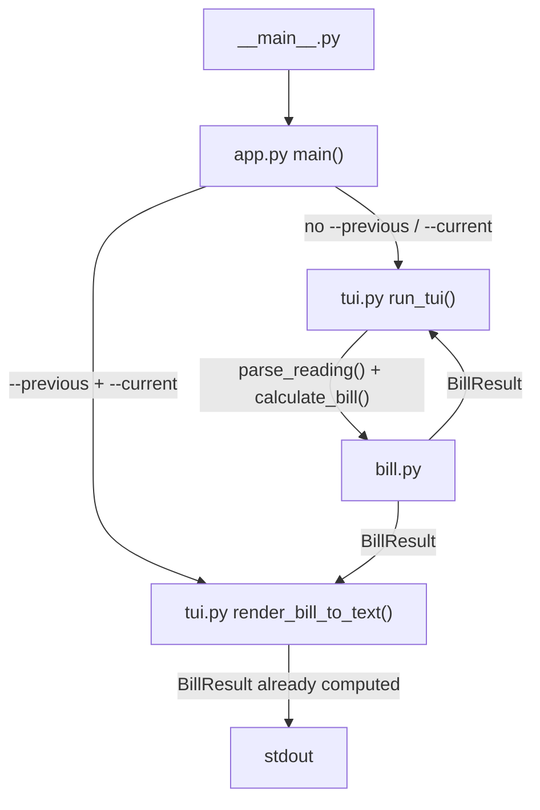

# Architecture

## Module responsibilities

| File | Responsibility |
|---|---|
| `tiered_bill_calculator/__main__.py` | Entry point — delegates immediately to `app.main()` |
| `tiered_bill_calculator/app.py` | Parses CLI arguments; routes to interactive TUI or one-shot mode |
| `tiered_bill_calculator/bill.py` | Pure calculation logic — no I/O, no side effects |
| `tiered_bill_calculator/tui.py` | All user-facing output: interactive loop and plain-text renderer |
| `tiered_bill_calculator/__init__.py` | Re-exports public API (`BillResult`, `TierBreakdownLine`, `calculate_bill`) |
| `tests/test_bill.py` | Unit tests for all four tier boundaries and the error case |

The dependency direction is strictly one-way:

```
__main__  →  app  →  tui  →  bill
                  ↘         ↗
                   (direct import of bill for one-shot mode)
```

`bill.py` has no imports from the rest of the package and can be used standalone.

## Data flow



## Entry-point matrix

| How the user runs it | Code path | Output |
|---|---|---|
| `python -m tiered_bill_calculator` | `app.main()` → `run_tui()` | Interactive terminal loop |
| `python -m tiered_bill_calculator --previous X --current Y` | `app.main()` → `render_bill_to_text()` | Single plain-text report printed to stdout |
| `python -m tiered_bill_calculator --no-clear` | same as first row, `clear_screen=False` | Interactive loop without screen clearing |

## Design principles

- **No third-party dependencies.** Only the Python standard library (`os`, `shutil`, `decimal`, `dataclasses`, `argparse`).
- **Pure core.** `bill.py` contains zero I/O. It takes readings, returns a `BillResult` dataclass. This makes it trivially testable and reusable.
 - **Separated presentation paths.** `tui.py` owns all user-facing output, with `render_bill_to_text()` used for the one-shot CLI path and a separate interactive result-display path used by `run_tui()`.
- **Exact arithmetic.** All monetary values use `decimal.Decimal` to avoid floating-point rounding errors.
